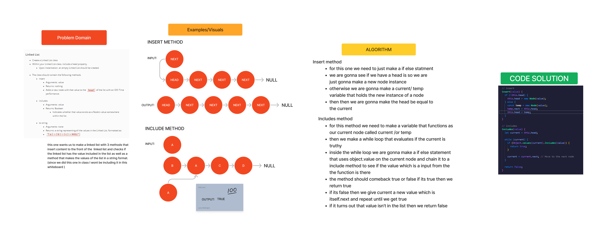
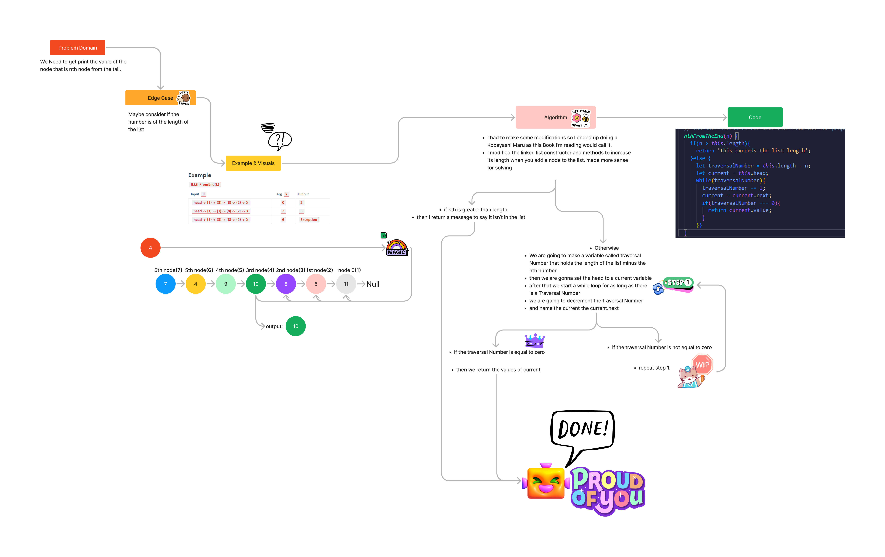
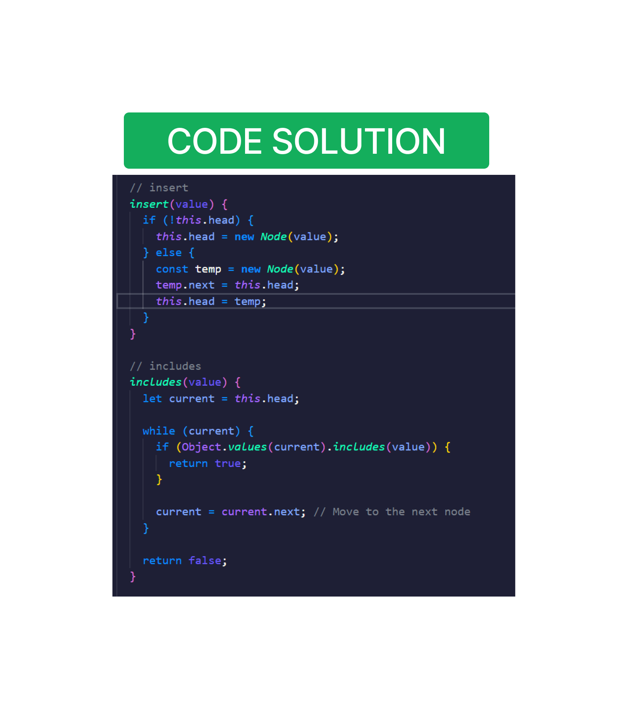
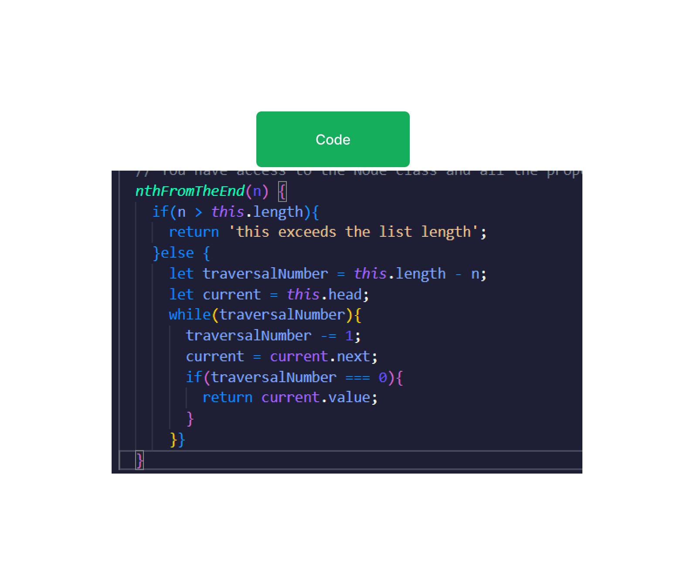

# Challenge 5 & 6

## Whiteboard Process

## Approach & Efficiency

CODE CHALLENGE 5
 I really wanted to use a object method for this code challenge because they are not something I'm very used to but in hindsight I could have used that and done a binary search since I was turning it into a array anyways.

CODE CHALLENGE 6
  I  wasn't really sweating this one but i do need to work on my testing skills I slept after class and almost forgot to turn this guy in.

Code Challenge 7

  I didn't get the test done in time but it was was able to find a viable solution.

## Solution

