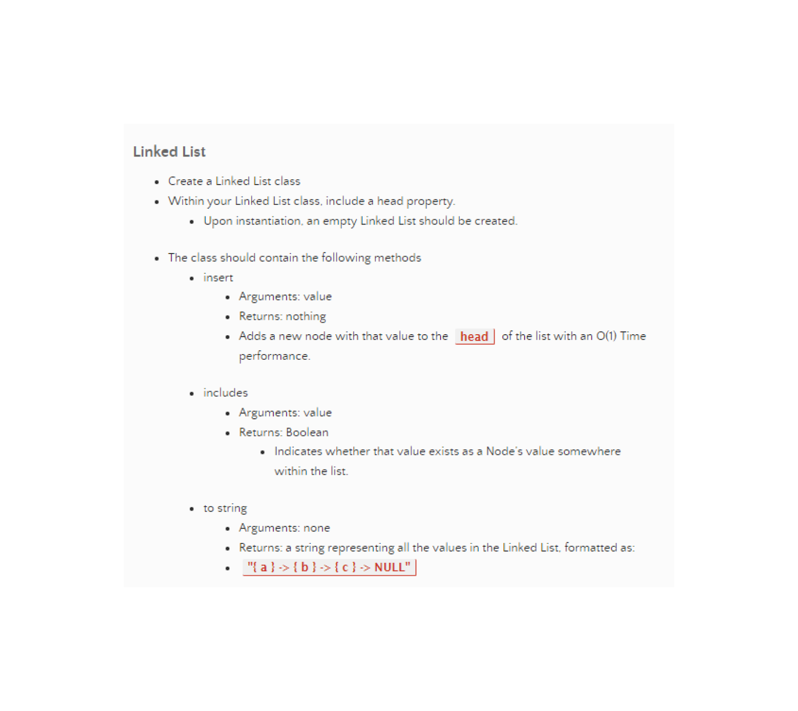

# Challenge Title

 

## Whiteboard Process

## Approach & Efficiency

 I really wanted to use a object method for this code challenge because they are not something I'm very used to but in hindsight I could have used that and done a binary search since I was turning it into a array anyways.

## Solution

